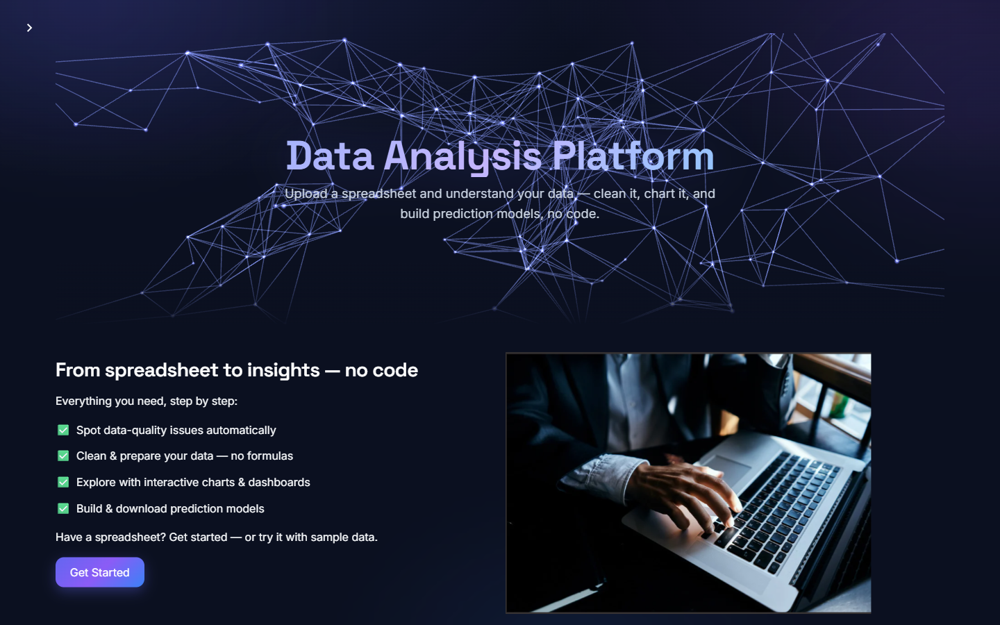

# Data Analysis Platform

**Upload a spreadsheet → understand it, clean it, chart it, and train a prediction model. No code.**

A guided six-step web app that takes a non-technical user from a raw CSV/Excel file to a
downloadable, production-usable machine-learning model — with the statistical rigor that
usually gets skipped in no-code tools.

<p>
  
  
  
  
  
  
</p>



---

## Try it in 30 seconds

<!-- LIVE_DEMO -->

```bash
git clone https://github.com/Abdulrhman86/data-analysis-platform.git
cd data-analysis-platform
docker compose up --build
```

Then open <http://localhost:8501> and click **"✨ Try it with sample data"** — a deliberately
messy 220-row sales dataset (missing values, mixed types, outliers) is bundled so you can walk
the entire workflow without finding a file first.

---

## Engineering highlights

This is the part I'd want a reviewer to read. The app is a wrapper; these are the decisions.

### 1. No data leakage — and it's *proven*, not asserted

Most no-code ML tools (and a lot of student projects) fit their scaler/encoder/imputer on the
**entire** dataset before splitting. That leaks test-set information into training and produces
accuracy scores that quietly lie.

Every model here trains inside an sklearn `Pipeline` + `ColumnTransformer` that is fit **only on
the training split** — and re-fit independently inside every cross-validation fold and every
hyperparameter-search fold.

`scripts/show_no_leakage.py` demonstrates it on demand:

```text
=== Demo 1: the scaler is fit on the TRAINING split only ===
  fitted scaler.mean_     = 2.0968
  X_train['x'].mean()     = 2.0968   <- the scaler matches this
  full dataset ['x'].mean = 2.0709   <- and NOT this (test never leaked in)

=== Demo 2: random target -> honest ~chance accuracy (no leakage) ===
  Leaky    (select features on ALL data, then CV): 0.655   <- falsely optimistic
  Our pipeline (preprocess fit inside each fold):  0.475   <- honest, ~0.5
```

Demo 2 is the important one: against a **completely random target**, a leaky pipeline reports
65.5% accuracy — impossible, and exactly the kind of number that gets a model shipped by mistake.
This pipeline reports 47.5%, correctly near chance.

### 2. The rest of the ML methodology, done deliberately

Leakage is the headline, but the same care is applied throughout — these are the decisions a
reviewer would check:

| Concern | How it's handled |
|---|---|
| **Preprocessing scope** | `ColumnTransformer` (median-impute + scale for numeric; mode-impute + one-hot for categorical) fit **only** on `X_train` |
| **Cross-validation** | A fresh pipeline is constructed per fold, so the imputer/scaler/encoder are re-fit inside every fold — never once on the whole set |
| **Hyperparameter search** | `GridSearchCV`/`RandomizedSearchCV` wraps the **entire pipeline**, so preprocessing is re-fit within each search fold too |
| **Train/test split** | Stratified for classification whenever every class has ≥2 members; rows with a missing target are dropped *before* splitting |
| **Class imbalance** | `class_weight="balanced"` applied automatically to every estimator that supports it (LogReg, SVM, tree ensembles) |
| **Multiclass ROC-AUC** | One-vs-rest with an **explicit class ordering**, so probability columns align with true labels — and scored only over classes actually present in the test split |
| **Average precision** | Computed with `average_precision_score`, not approximated by averaging precision values |
| **Unseen categories** | `handle_unknown="ignore"` — a category absent at training time doesn't crash inference |
| **Degenerate features** | Zero-variance columns dropped before scaling; one-hot width capped to prevent high-cardinality explosion |
| **Small / imbalanced data** | CV fold count is clamped to the smallest class count instead of raising, with the reduction reported |

### 3. Models that are self-contained

An exported model isn't just an estimator — it carries its own preprocessing. You can hand it a
**raw** row (unscaled, unencoded, with missing values, with categories it has never seen) and it
predicts correctly. The in-app *Predict* tab re-applies the same recorded feature-engineering
recipe to a raw uploaded file, so the model behaves identically inside and outside the app.

### 4. Built for messy real data, not just the happy path

Hardened against the things that actually break data tools: numbers stored as text, non-UTF-8
encodings, semicolon/tab delimiters, duplicate column headers, empty files, all-NaN columns,
zero-variance features, high-cardinality categoricals (one-hot explosion), single-class targets,
and datasets too small for the requested number of CV folds.

### 5. Tested and containerized

**98 automated tests** covering the ML pipeline, leakage prevention, ingestion edge cases,
preprocessing replay, persistence robustness, security sanitization, chart builders, and the
model export → reload → predict round-trip. Ships with a `Dockerfile` (non-root user, healthcheck)
and `docker-compose.yml`.

### 6. Security and durability

User-supplied content (column names, filenames, chart titles) is escaped before reaching raw HTML;
the replayable preprocessing pipeline uses an allowlist so a crafted pipeline file can't invoke
arbitrary methods; dashboards are saved atomically and load fault-isolated, so one corrupt record
can't wipe the rest.

---

## The workflow

| # | Step | What it does |
|---|------|--------------|
| 1 | **Upload** | CSV/Excel import with encoding + delimiter fallback, automatic date detection, type inference |
| 2 | **Data Quality** | Automated assessment with severity-ranked findings: missing values, outliers, skew, duplicates, high cardinality |
| 3 | **Preprocessing** | Imputation, scaling, binning, encoding, datetime features, feature engineering/selection — all recordable and replayable |
| 4 | **Visualization** | Single-variable, relationship, distribution, time-series, summary statistics, and advanced charts (parallel coordinates, radar, 3D scatter, sunburst) |
| 5 | **Dashboard** | Assemble saved charts into filterable dashboards; persisted to disk and exportable as self-contained HTML |
| 6 | **Machine Learning** | Train, tune, evaluate, compare, and export classification & regression models — then predict on new data |

**Models:** Logistic Regression, Decision Tree, Random Forest, SVM, Naive Bayes, KNN,
HistGradientBoosting · Linear, Ridge, Lasso, ElasticNet, KNN, HistGradientBoosting regressors —
with optional grid/randomized hyperparameter search and cross-validation.

---

## Run it

### Docker (recommended)

```bash
docker compose up --build
```

Open <http://localhost:8501>. To persist dashboards across restarts, mount a volume and set
`DASHBOARD_DIR` (see [DOCKER.md](DOCKER.md)).

### Local (Python 3.11)

```bash
python -m venv .venv
.venv\Scripts\Activate.ps1        # Windows;  source .venv/bin/activate on macOS/Linux
pip install -r requirements.txt
streamlit run app/home.py         # from the project root
```

### Tests

```bash
pip install -r requirements-dev.txt
pytest                            # 98 tests
```

### Verify the no-leakage claim yourself

```bash
python scripts/show_no_leakage.py
```

---

## Architecture

```
data_mining/
├── app/
│   ├── home.py                  # entry point — landing page (WebGL hero via components.html)
│   ├── config.py                # design system, CSS tokens, shared UI helpers
│   ├── pages/                   # the six workflow pages
│   ├── utils/                   # the engine (see below)
│   ├── static/                  # bundled sample dataset + images
│   └── tests/                   # 98 pytest tests
├── scripts/show_no_leakage.py   # runnable proof of the leakage-free design
├── Dockerfile · docker-compose.yml
└── docs/                        # deployment guide, defense notes, positioning
```

`utils/` is where the work lives, separated by concern:

- **`ml_processor.py`** — the leakage-free `Pipeline` + `ColumnTransformer` core; `classification_models.py` / `regression_models.py` extend it
- **`preprocessing_pipeline.py`** — records transformations as replayable steps (with a security allowlist)
- **`charts.py`** — one shared chart-building core used by both the dashboard and visualization layers
- **`data_quality.py`**, **`feature_engineering.py`**, **`model_export.py`**, **`model_evaluation.py`**

---

## Tech stack

**Python 3.11** · **Streamlit** (UI) · **pandas** / **NumPy** / **SciPy** (data) ·
**scikit-learn** (ML) · **Plotly** / **Matplotlib** / **Seaborn** (charts) ·
**pytest** (tests) · **Docker** (packaging) · **three.js** (landing-page WebGL background)

---

## Honest limitations

- Single-user by design — no authentication or multi-tenancy.
- In-memory processing: practical up to roughly a few hundred thousand rows; large files are
  down-sampled for charting rather than distributed.
- Automatic feature selection uses statistical tests that require numeric input, so it operates
  on numeric columns only (manual and "use all" selection accept categoricals for both tasks).
- Deep-learning models are out of scope; the focus is classical ML done correctly.

---

## About

Built by **Abdulrhman Alramahi**, with contributions from **Bashar Dabayba** as an undergraduate graduation project (Data Science & AI).

The goal was to make rigorous machine learning accessible to people who don't write code —
without the methodological shortcuts that make "easy" ML tools produce numbers you can't trust.

## License

[MIT](LICENSE)
